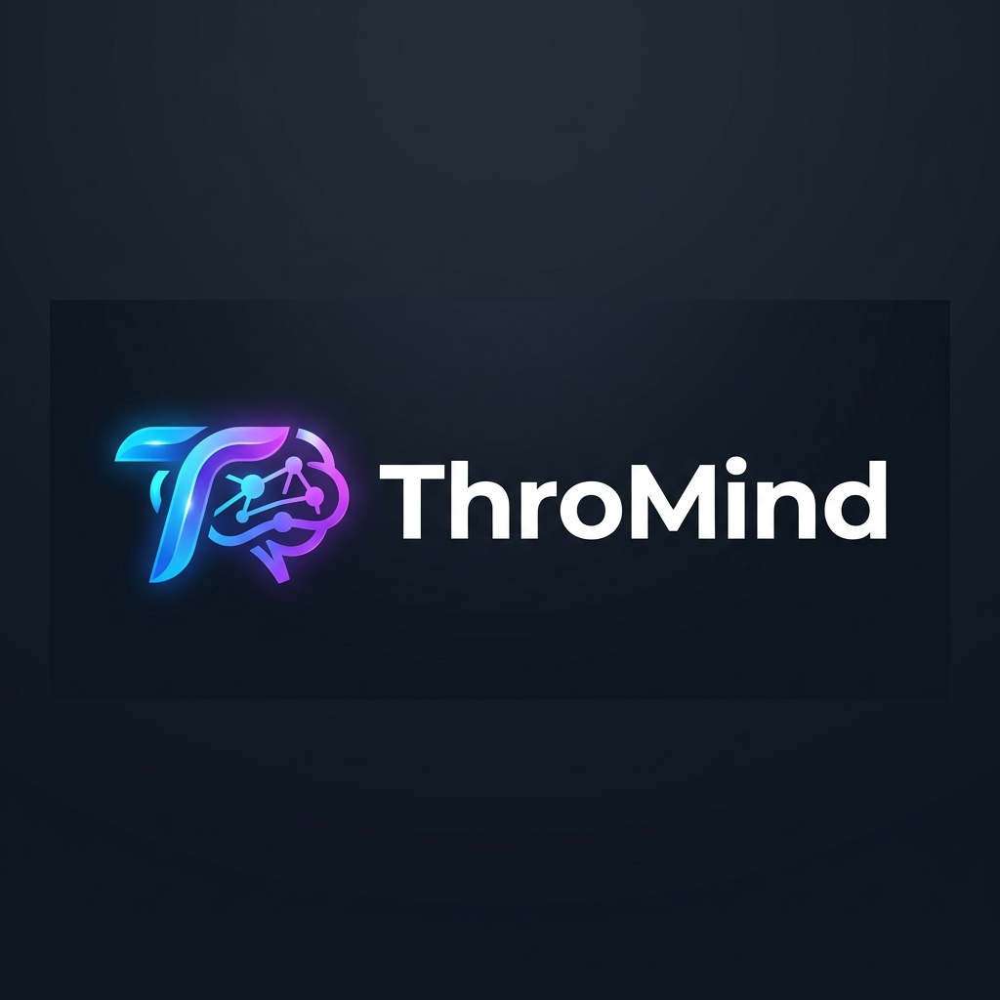

# ThroMind AI Assistant 🚀

A next-generation, AI-powered conversational assistant designed for **ThroMind**, a leading technology company based in Sudan. The application serves as an intelligent agent capable of answering questions regarding products, pricing, policies, and general company information, natively supporting both Arabic and English.

## ✨ Features

- **Intelligent Knowledge Base**: Uses a customized JSON knowledge base (`thromind.json`) to accurately respond to customer inquiries.
- **Bilingual Support**: Fluent in both English and Arabic, automatically responding in the user's preferred language.
- **Modern UI Edge**: Premium dark-mode interface with glassmorphism, fluid animations (typing indicators), and robust responsiveness built purely with custom CSS.
- **Vercel AI SDK Integration**: Utilizes the official `ai` and `@ai-sdk/openai` packages for seamless streaming of LLM outputs.
- **Rate Limit & Error Handling**: Gracefully handles API failures and quota limits with localized user-friendly warnings.
- **Dockerized**: Fully equipped with a Next.js optimized multi-stage `Dockerfile` and `standalone` output for efficient and lightweight containerized deployment.

## 🛠️ Tech Stack

- **Framework**: [Next.js 16](https://nextjs.org/) (App Directory)
- **Language**: TypeScript
- **AI/LLM**: [OpenAI GPT-4o-mini](https://openai.com/) via [Vercel AI SDK v3](https://sdk.vercel.ai/docs)
- **Database Prep**: DataStax AstraDB / LangChain *(for optional advanced vector searching)*
- **Styling**: Vanilla Custom CSS
- **Containerization**: Docker

---

## 🚀 Getting Started

### Prerequisites
Before you start, ensure you have the following installed on your machine:
- **Node.js** (v18 or higher)
- **npm** or **yarn**
- **Docker** (optional, for containerized run)

### 1. Clone the repository
\`\`\`bash
git clone https://github.com/mosab3482/ThorMind-AI.git
cd thromind_ai
\`\`\`

### 2. Environment Variables
Create a `.env` file in the root of your project and populate it with your keys.
\`\`\`env
# OpenAI
OPENAI_API_KEY="sk-proj-your-api-key"

# Astra DB (If using the vector DB module)
ASTRA_DB_NAMESPACE="default_keyspace"
ASTRA_DB_COLLECTION="ThorMindAI"
ASTRA_DB_API_ENDPOINT="https://..."
ASTRA_DB_APPLICATION_TOKEN="AstraCS:..."
\`\`\`

*(Note: The current configuration primarily relies on the local JSON file located at `app/data/thromind.json` for high-speed local inference, saving database costs).*

### 3. Local Development Run (Node.js)
Install the dependencies and start the development server.
\`\`\`bash
npm install
npm run dev
\`\`\`
Open [http://localhost:3000](http://localhost:3000) in your browser to start chatting with the AI!

---

## 🐳 Docker Deployment

The application utilizes the Next.js `standalone` output feature to create extremely optimized, minimal-size Docker images.

**1. Build the Docker Image**
\`\`\`bash
docker build -t thromind-ai:latest .
\`\`\`

**2. Run the Docker Container**
You must pass your `.env` file to the container so that it can access the OpenAI API key.
\`\`\`bash
docker run -p 3000:3000 --env-file .env thromind-ai:latest
\`\`\`

The app will now be available on [http://localhost:3000](http://localhost:3000).

---

## 📂 Project Structure

\`\`\`text
.
├── app/
│   ├── api/
│   │   └── chat/route.ts      # Main API endpoint for OpenAI streaming
│   ├── assets/                # Logos and Images
│   ├── components/            # Reusable UI Components (Bubble, Loader, Prompts)
│   ├── data/                  # Company Knowledge Base (thromind.json)
│   ├── global.css             # Premium styling
│   ├── layout.tsx             # Root layout and metadata
│   └── page.tsx               # Main Chat UI Page
├── scripts/
│   └── loadDb.ts              # Script for seeding Astra DB embeddings
├── .dockerignore
├── Dockerfile                 # Multi-stage optimized Docker build instructions
└── next.config.ts             # Configured for "standalone" output
\`\`\`

## 📝 Modifying the Knowledge Base
To update the Company's details, products, pricing (currently strictly set in **USD**), or policies, simply edit the `app/data/thromind.json` file. The AI system prompt dynamically pulls data from this JSON file on every request, ensuring the AI always has the latest information.

---

**Developed for ThroMind AI Assistant.** 
*Khartoum, Sudan* — *support@thromind.com*
